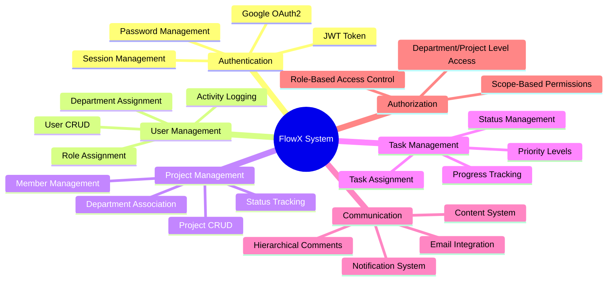
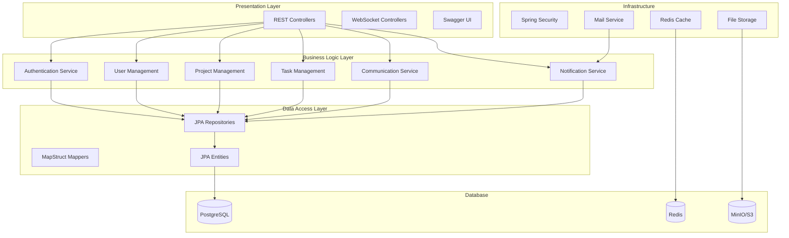
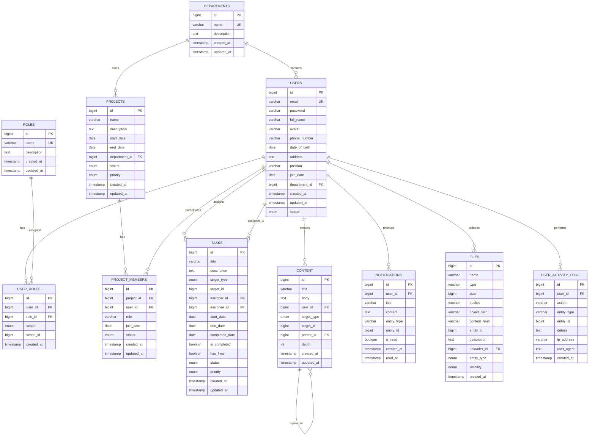
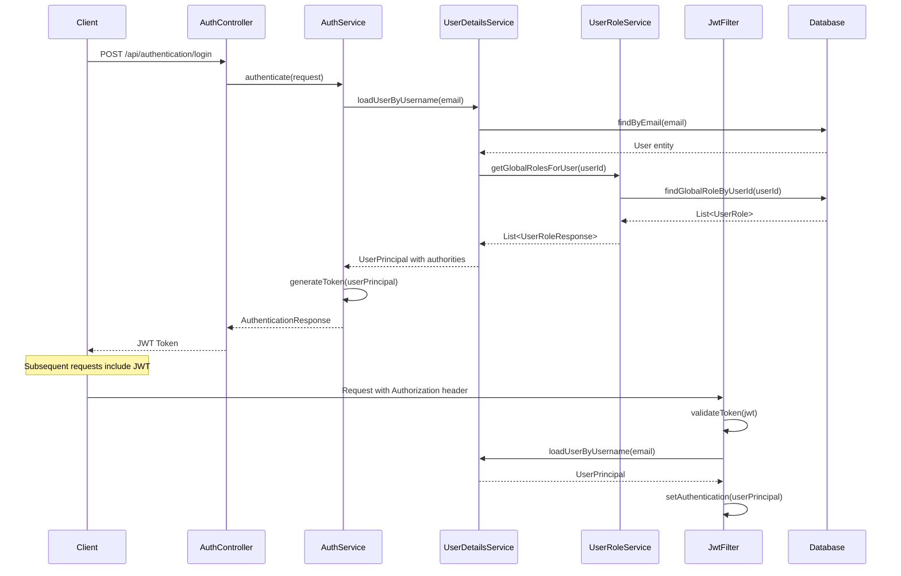
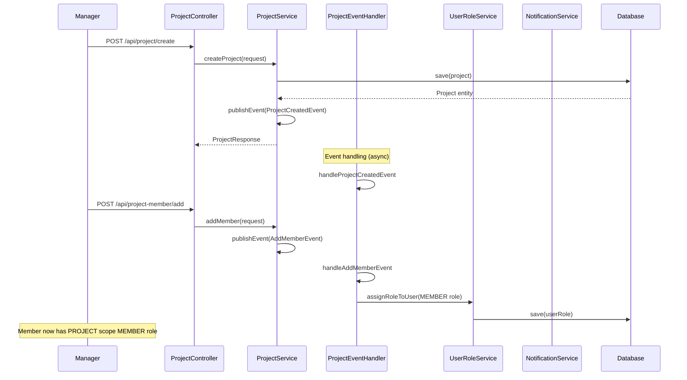
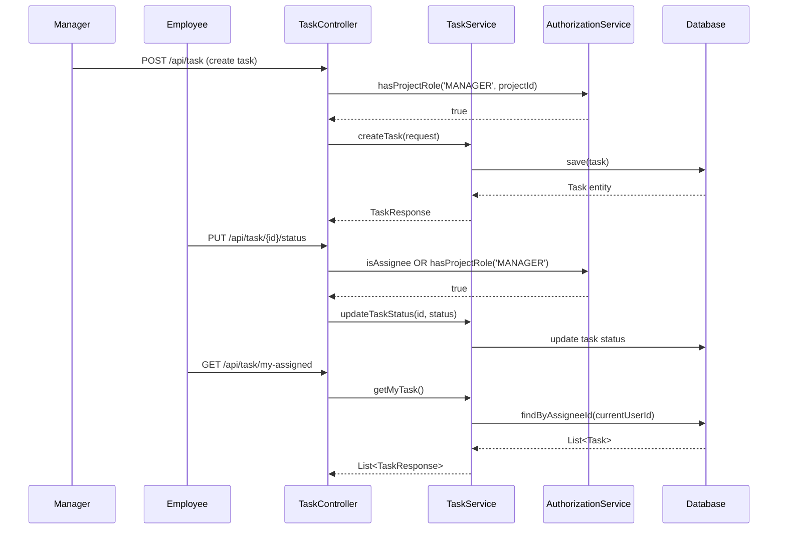
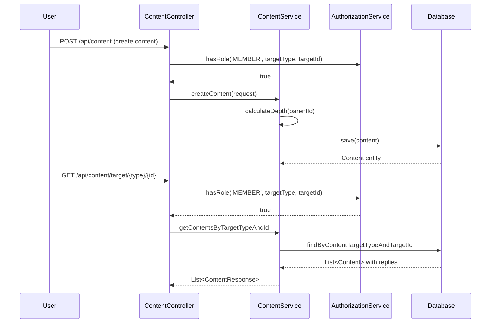
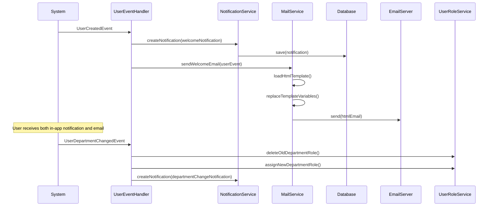
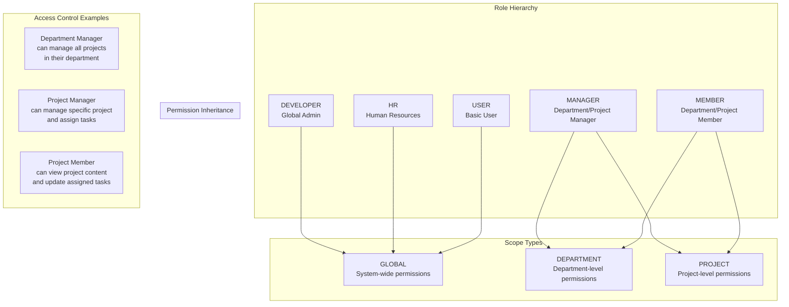
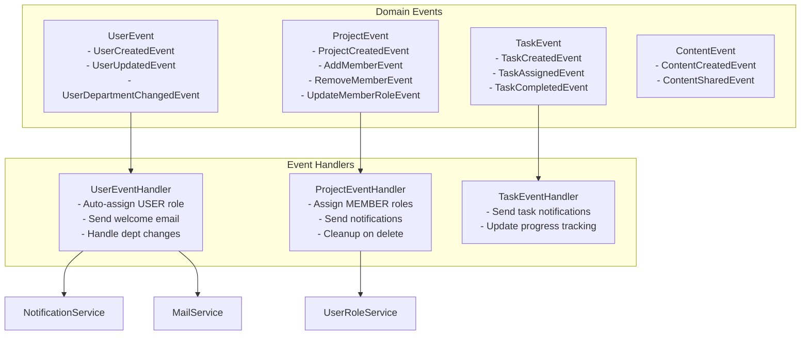

# FlowX Technical Report
## Enterprise Communication & Management System

### Table of Contents
1. [System Overview](#1-system-overview)
2. [Core Features](#2-core-features-implemented)
3. [System Architecture](#3-system-architecture)
4. [Database Schema](#4-database-schema)
5. [Authentication & Authorization Flow](#5-authentication--authorization-flow)
6. [Project Management Flow](#6-project-management-flow)
7. [Task Management Flow](#7-task-management-flow)
8. [Content & Communication Flow](#8-content--communication-flow)
9. [Notification System Flow](#9-notification-system-flow)
10. [Security & Authorization Model](#10-security--authorization-model)
11. [API Endpoints Summary](#11-api-endpoints-summary)
12. [Event-Driven Architecture](#12-event-driven-architecture)
13. [Caching Strategy](#13-caching-strategy)
14. [Key Design Patterns](#14-key-design-patterns)
15. [Security Features](#15-security-features)
16. [Performance Optimizations](#16-performance-optimizations)

---

### 1. System Overview

FlowX là một hệ thống quản lý và giao tiếp doanh nghiệp được xây dựng trên Spring Boot, tập trung vào việc quản lý dự án, phân quyền người dùng, và giao tiếp nội bộ.

#### Technology Stack:
- **Backend**: Spring Boot 3.x, Spring Security, Spring Data JPA
- **Database**: PostgreSQL (primary), Redis (cache)
- **Authentication**: JWT, Google OAuth2
- **File Storage**: MinIO/S3
- **Email**: Spring Mail
- **Documentation**: OpenAPI/Swagger
- **Build Tool**: Maven

---

### 2. Core Features (Implemented)



---

### 3. System Architecture



---

### 4. Database Schema



---

### 5. Authentication & Authorization Flow



---

### 6. Project Management Flow



---

### 7. Task Management Flow



---

### 8. Content & Communication Flow



---

### 9. Notification System Flow



---

### 10. Security & Authorization Model



---

### 11. API Endpoints Summary

```mermaid
graph LR
    subgraph "Authentication APIs"
        AUTH_LOGIN[POST /api/authentication/login]
        AUTH_LOGOUT[POST /api/authentication/logout]
        AUTH_CHANGE_PWD[PUT /api/authentication/change-password]
        AUTH_GOOGLE[POST /api/authentication/google-oath2]
    end
    
    subgraph "User Management APIs"
        USER_CREATE[POST /api/user/create]
        USER_UPDATE[PUT /api/user/update/{id}]
        USER_GET[GET /api/user/get/{id}]
        USER_DEPT[PUT /api/user/change-department/{id}]
    end
    
    subgraph "Project Management APIs"
        PROJ_CREATE[POST /api/project/create]
        PROJ_UPDATE[PUT /api/project/update/{id}]
        PROJ_MEMBERS[GET /api/project-member/project/{id}]
        PROJ_ADD_MEMBER[POST /api/project-member/add]
    end
    
    subgraph "Task Management APIs"
        TASK_CREATE[POST /api/task]
        TASK_UPDATE[PUT /api/task/{id}]
        TASK_MY[GET /api/task/my-assigned]
        TASK_STATUS[PUT /api/task/{id}/status]
    end
    
    subgraph "Communication APIs"
        CONTENT_CREATE[POST /api/content]
        CONTENT_GET[GET /api/content/target/{type}/{id}]
        NOTIFY_GET[GET /api/notification/my-notifications]
        NOTIFY_READ[PUT /api/notification/{id}/mark-read]
    end
```

#### Key API Endpoints:

**Authentication:**
- `POST /api/authentication/login` - User login with email/password
- `POST /api/authentication/google-oath2` - Google OAuth2 login
- `PUT /api/authentication/change-password` - Change user password
- `POST /api/authentication/logout` - User logout

**User Management:**
- `POST /api/user/create` - Create new user (MANAGER/HR only)
- `GET /api/user/getall` - Get all users
- `PUT /api/user/update/{id}` - Update user information
- `PUT /api/user/change-department/{id}` - Change user department

**Project Management:**
- `POST /api/project/create` - Create new project
- `GET /api/project/getall` - Get all projects
- `POST /api/project-member/add` - Add member to project
- `GET /api/project-member/project/{id}` - Get project members

**Task Management:**
- `POST /api/task` - Create new task
- `GET /api/task/my-assigned` - Get tasks assigned to current user
- `PUT /api/task/{id}/status` - Update task status
- `GET /api/task/project/{projectId}` - Get tasks by project

**Communication:**
- `POST /api/content` - Create content/post
- `GET /api/content/target/{type}/{id}` - Get content by target
- `GET /api/notification/my-notifications` - Get user notifications
- `PUT /api/notification/{id}/mark-read` - Mark notification as read

---

### 12. Event-Driven Architecture



#### Event Processing:

**User Events:**
- `UserCreatedEvent`: Auto-assigns USER role, sends welcome notification and email
- `UserDepartmentChangedEvent`: Updates department roles, sends notification

**Project Events:**
- `ProjectCreatedEvent`: Logs project creation
- `AddMemberEvent`: Assigns MEMBER role to user for project scope
- `RemoveMemberEvent`: Removes user roles for project scope

**Task Events:**
- `TaskCreatedEvent`: Sends notification to assignee
- `TaskCompletedEvent`: Updates project progress metrics

---

### 13. Caching Strategy

```mermaid
graph TB
    subgraph "Cached Data"
        USER_ROLES[User Local Roles<br/>@Cacheable("userLocalRoles")]
        DEPARTMENTS[Departments<br/>@Cacheable("departments")]
        PROJECT_MEMBERS[Project Members<br/>@Cacheable("projectMembers")]
        USER_PROJECTS[User Projects<br/>@Cacheable("userProjects")]
    end
    
    subgraph "Cache Eviction"
        ROLE_ASSIGN[Role Assignment<br/>@CacheEvict("userLocalRoles")]
        DEPT_UPDATE[Department Update<br/>@CacheEvict("departments")]
        MEMBER_UPDATE[Member Update<br/>@CacheEvict("projectMembers")]
    end
    
    subgraph "Cache Implementation"
        REDIS[Redis<br/>Distributed Cache]
        SPRING_CACHE[Spring Cache<br/>Abstraction Layer]
    end
    
    USER_ROLES --> REDIS
    DEPARTMENTS --> REDIS
    PROJECT_MEMBERS --> REDIS
    USER_PROJECTS --> REDIS
    
    SPRING_CACHE --> REDIS
```

#### Caching Implementation:

**Cached Entities:**
- User roles (local/non-global): `@Cacheable("userLocalRoles")`
- Department list: `@Cacheable("departments")`
- Project members: `@Cacheable("projectMembers")`
- User projects: `@Cacheable("userProjects")`

**Cache Eviction Triggers:**
- Role assignment/removal: Evicts user role cache
- Department updates: Evicts department cache
- Project member changes: Evicts member and user project caches

---

### 14. Key Design Patterns

1. **Repository Pattern**: JPA repositories for data access abstraction
2. **Service Layer Pattern**: Business logic separation from controllers
3. **DTO Pattern**: MapStruct for entity-DTO mapping and data transfer
4. **Event-Driven Pattern**: Spring Events for loose coupling between components
5. **Strategy Pattern**: Multiple authentication methods (JWT, OAuth2)
6. **Builder Pattern**: Entity creation with Lombok @Builder annotation
7. **Facade Pattern**: Service layer abstracts complex business operations
8. **Observer Pattern**: Event listeners for cross-cutting concerns

---

### 15. Security Features

#### Authentication:
- **JWT Token Authentication** with configurable expiration
- **Google OAuth2 Integration** for social login
- **Password Encryption** using BCrypt hashing
- **Token Invalidation** on logout with blacklist

#### Authorization:
- **Role-Based Access Control (RBAC)** with hierarchical roles
- **Scope-Based Permissions** (Global, Department, Project)
- **Method-Level Security** with @PreAuthorize annotations
- **Resource-Level Access Control** based on ownership and membership

#### Security Configuration:
- **CORS Configuration** for cross-origin requests
- **CSRF Protection** disabled for stateless API
- **Security Headers** for XSS and clickjacking protection
- **Input Validation** with Bean Validation annotations

---

### 16. Performance Optimizations

#### Database Optimizations:
- **JPA Entity Graphs** for optimized query fetching
- **Database Indexing** on frequently queried columns
- **Lazy Loading** for entity relationships to reduce memory usage
- **Connection Pooling** with HikariCP for efficient database connections

#### Application Optimizations:
- **Redis Caching** for frequently accessed data
- **Async Event Processing** with @EnableAsync for non-blocking operations
- **Pagination Support** for large data sets
- **Query Optimization** with custom repository methods

#### Infrastructure:
- **Load Balancing** ready architecture
- **Stateless Design** for horizontal scaling
- **Microservice Ready** with clear service boundaries
- **Health Checks** with Spring Boot Actuator

---

### 17. Configuration & Deployment

#### Application Properties:
```properties
# Database Configuration
spring.datasource.url=jdbc:postgresql://localhost:5432/flowx
spring.jpa.hibernate.ddl-auto=update

# Redis Configuration
spring.redis.host=localhost
spring.redis.port=6379

# JWT Configuration
spring.jwt.secret=${JWT_SECRET}
spring.jwt.expiration=86400000

# Email Configuration
spring.mail.host=smtp.gmail.com
spring.mail.port=587

# File Storage
minio.endpoint=http://localhost:9000
minio.access-key=${MINIO_ACCESS_KEY}
minio.secret-key=${MINIO_SECRET_KEY}
```

#### Docker Support:
```dockerfile
FROM openjdk:17-jdk-slim
COPY target/flowx-*.jar app.jar
EXPOSE 8080
ENTRYPOINT ["java", "-jar", "/app.jar"]
```

---

### 18. Future Enhancements

#### Planned Features:
1. **Real-time Chat System** with WebSocket implementation
2. **File Upload/Download** with MinIO integration
3. **Advanced Reporting** with analytics dashboard
4. **Mobile App Support** with REST API optimization
5. **Workflow Engine** for automated business processes

#### Technical Improvements:
1. **Microservices Architecture** migration
2. **Event Sourcing** for audit trails
3. **GraphQL API** for flexible data fetching
4. **Kubernetes Deployment** for container orchestration
5. **Monitoring & Logging** with ELK stack

---

### 19. Conclusion

FlowX là một hệ thống enterprise communication và management được thiết kế với kiến trúc hiện đại, bảo mật cao và khả năng mở rộng tốt. Hệ thống sử dụng các best practices trong phát triển Spring Boot application và có thể đáp ứng nhu cầu quản lý dự án và giao tiếp trong doanh nghiệp vừa và lớn.

**Điểm mạnh:**
- Kiến trúc rõ ràng với separation of concerns
- Bảo mật đa lớp với JWT và OAuth2
- Event-driven architecture cho loose coupling
- Caching strategy hiệu quả với Redis
- API documentation đầy đủ với OpenAPI

**Khuyến nghị:**
- Implement real-time features với WebSocket
- Thêm comprehensive testing với unit và integration tests
- Setup CI/CD pipeline cho automated deployment
- Monitoring và logging cho production environment
- Performance testing và optimization

---

*Document Version: 1.0*  
*Last Updated: December 2024*  
*Author: FlowX Development Team*