# Báo Cáo Kỹ Thuật FlowX
## Hệ Thống Giao Tiếp và Quản Lý Doanh Nghiệp

### Mục Lục
1. [Tổng Quan Hệ Thống](#1-tổng-quan-hệ-thống)
2. [Tính Năng Cốt Lõi](#2-tính-năng-cốt-lõi-đã-triển-khai)
3. [Kiến Trúc Hệ Thống](#3-kiến-trúc-hệ-thống)
4. [Sơ Đồ Cơ Sở Dữ Liệu](#4-sơ-đồ-cơ-sở-dữ-liệu)
5. [Luồng Xác Thực và Phân Quyền](#5-luồng-xác-thực-và-phân-quyền)
6. [Luồng Quản Lý Dự Án](#6-luồng-quản-lý-dự-án)
7. [Luồng Quản Lý Nhiệm Vụ](#7-luồng-quản-lý-nhiệm-vụ)
8. [Luồng Nội Dung và Giao Tiếp](#8-luồng-nội-dung-và-giao-tiếp)
9. [Luồng Hệ Thống Thông Báo](#9-luồng-hệ-thống-thông-báo)
10. [Mô Hình Bảo Mật và Phân Quyền](#10-mô-hình-bảo-mật-và-phân-quyền)
11. [Tóm Tắt API Endpoints](#11-tóm-tắt-api-endpoints)
12. [Kiến Trúc Hướng Sự Kiện](#12-kiến-trúc-hướng-sự-kiện)
13. [Chiến Lược Cache](#13-chiến-lược-cache)
14. [Các Mẫu Thiết Kế Chính](#14-các-mẫu-thiết-kế-chính)
15. [Tính Năng Bảo Mật](#15-tính-năng-bảo-mật)
16. [Tối Ưu Hóa Hiệu Suất](#16-tối-ưu-hóa-hiệu-suất)

---

### 1. Tổng Quan Hệ Thống

FlowX là một hệ thống quản lý và giao tiếp doanh nghiệp được xây dựng trên nền tảng Spring Boot, tập trung vào việc quản lý dự án, phân quyền người dùng, và giao tiếp nội bộ tổ chức.

#### Công Nghệ Sử Dụng:
- **Backend**: Spring Boot 3.x, Spring Security, Spring Data JPA
- **Cơ Sở Dữ Liệu**: PostgreSQL (chính), Redis (cache)
- **Xác Thực**: JWT, Google OAuth2
- **Lưu Trữ File**: MinIO/S3
- **Email**: Spring Mail
- **Tài Liệu**: OpenAPI/Swagger
- **Công Cụ Build**: Maven

---

### 2. Tính Năng Cốt Lõi (Đã Triển Khai)

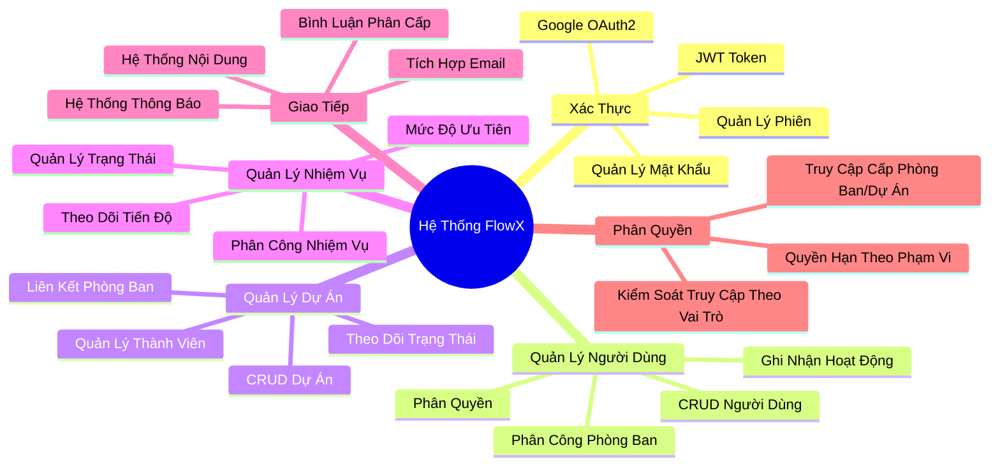

---

### 3. Kiến Trúc Hệ Thống

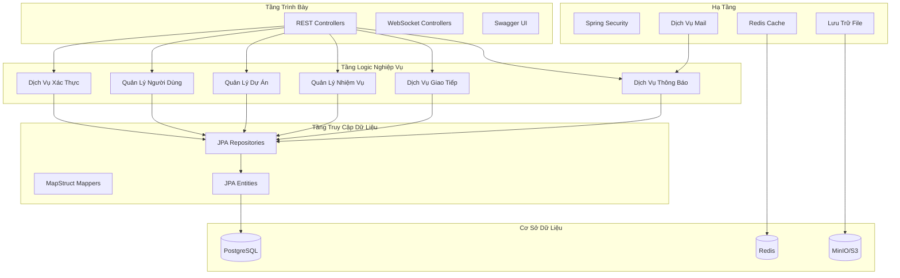

---

### 4. Sơ Đồ Cơ Sở Dữ Liệu


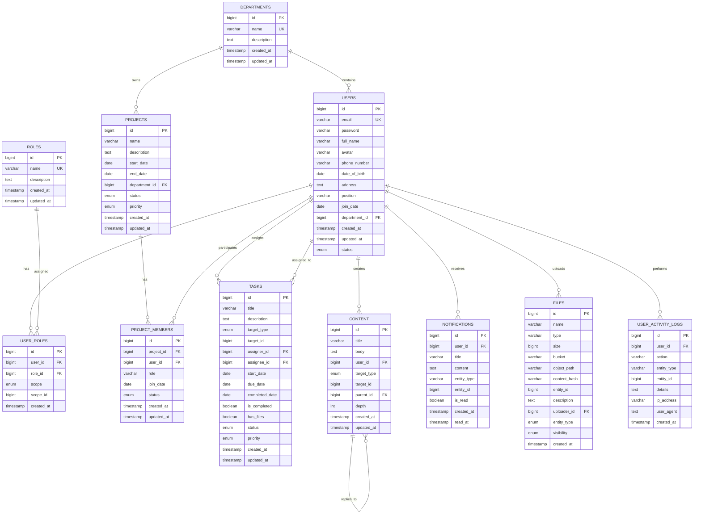

---

### 5. Luồng Xác Thực và Phân Quyền

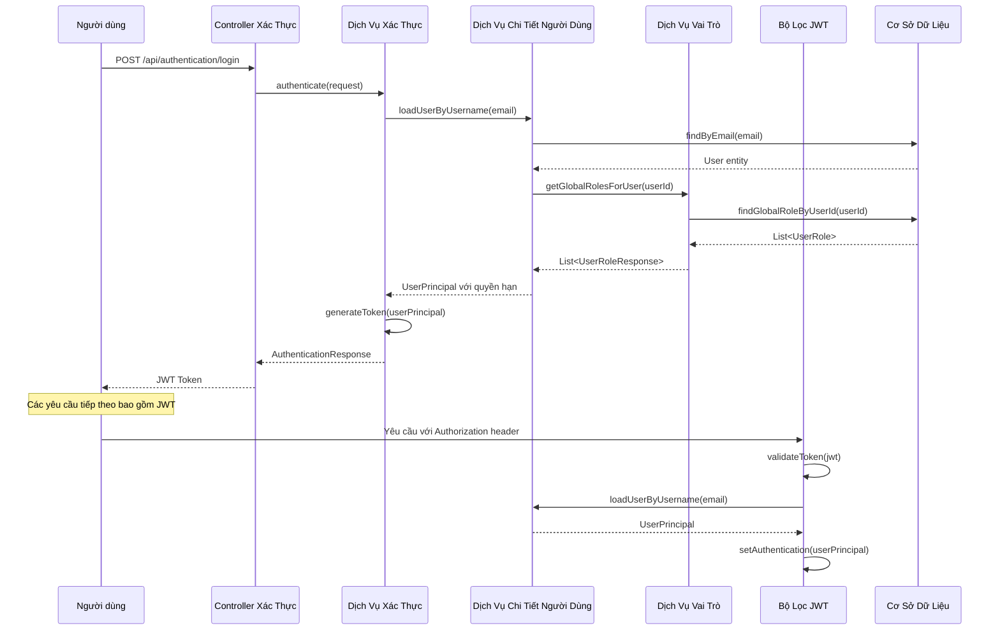

---

### 6. Luồng Quản Lý Dự Án

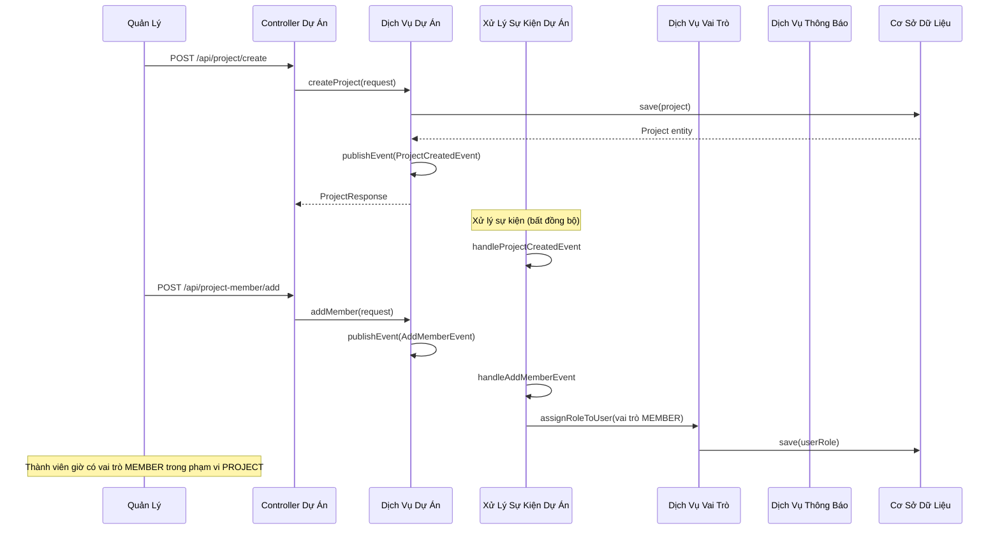

---

### 7. Luồng Quản Lý Nhiệm Vụ

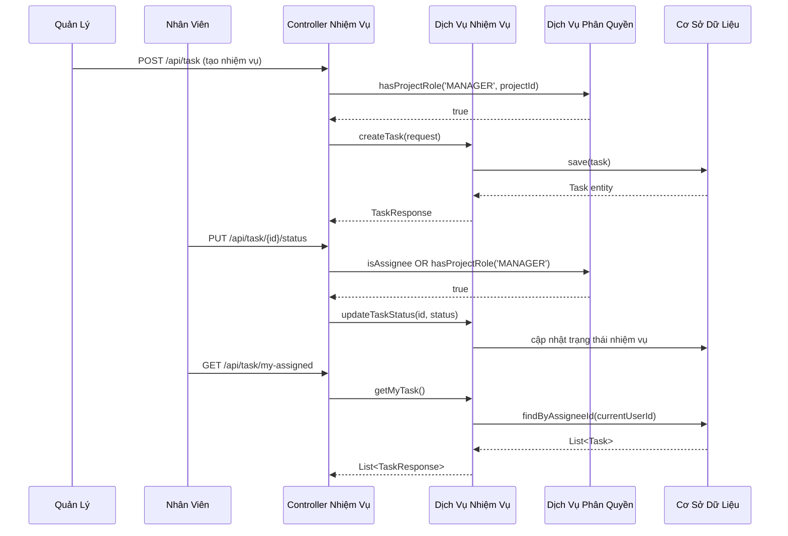

---

### 8. Luồng Nội Dung và Giao Tiếp

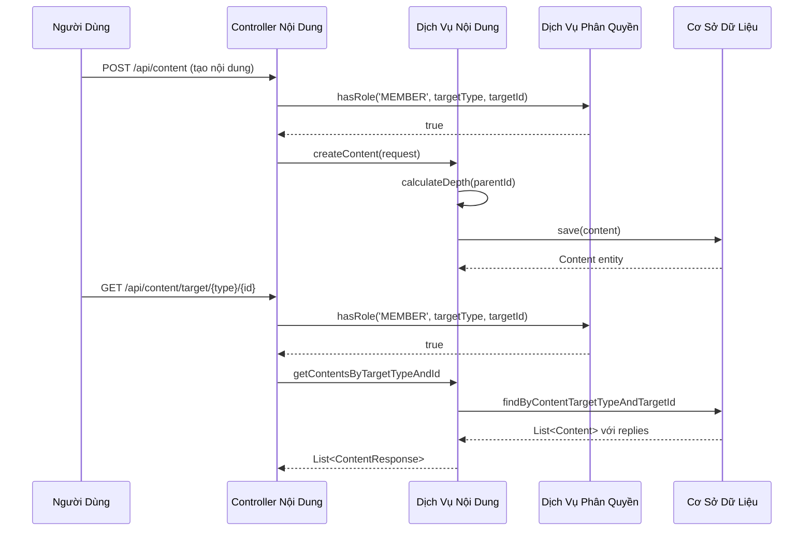

---

### 9. Luồng Hệ Thống Thông Báo

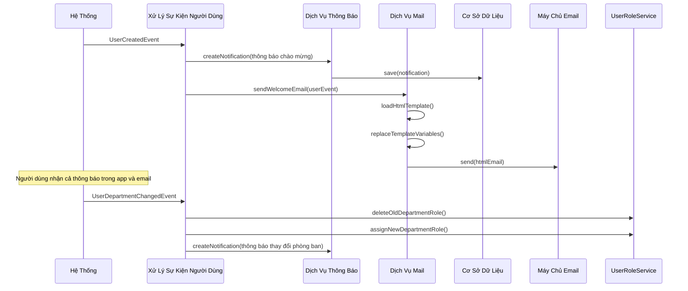

---

### 10. Mô Hình Bảo Mật và Phân Quyền

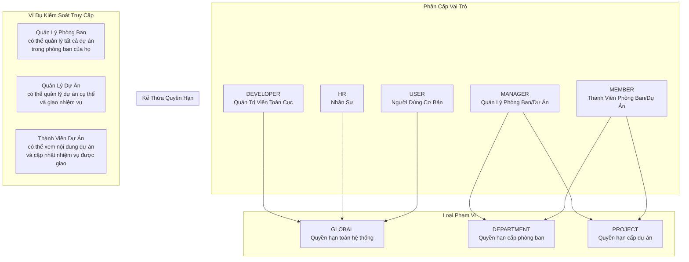

---

### 11. API Endpoints

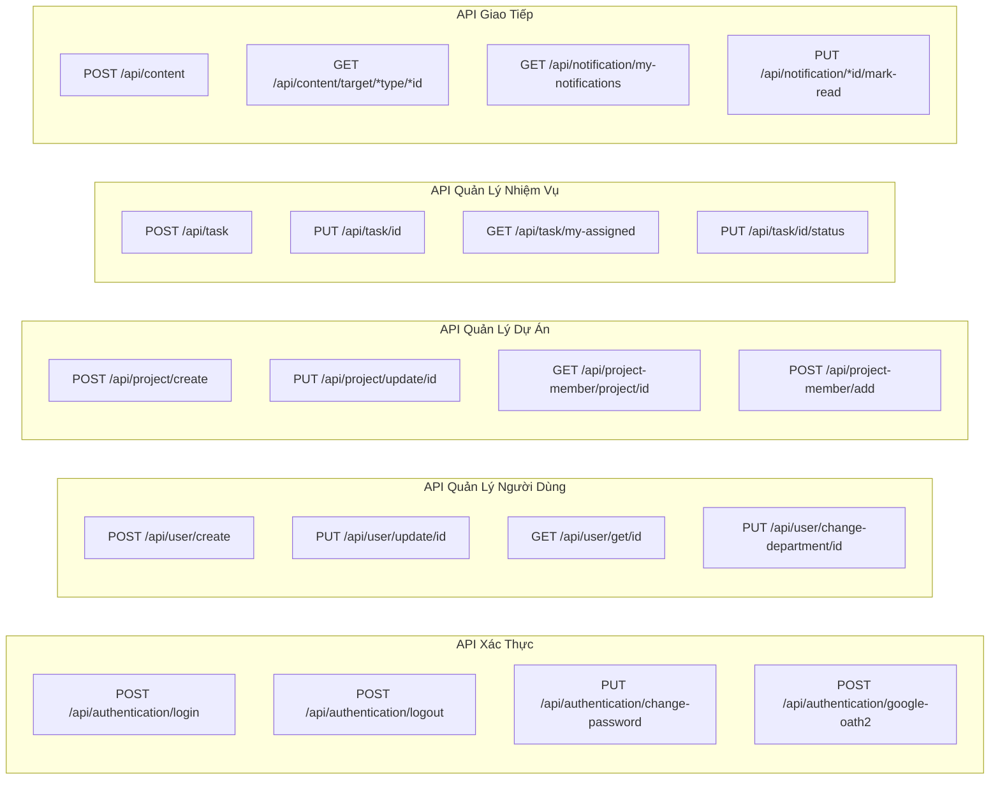

#### Các API Endpoints Chính:

**Xác Thực:**
- `POST /api/authentication/login` - Đăng nhập bằng email/mật khẩu
- `POST /api/authentication/google-oath2` - Đăng nhập Google OAuth2
- `PUT /api/authentication/change-password` - Thay đổi mật khẩu người dùng
- `POST /api/authentication/logout` - Đăng xuất người dùng

**Quản Lý Người Dùng:**
- `POST /api/user/create` - Tạo người dùng mới (chỉ MANAGER/HR)
- `GET /api/user/getall` - Lấy tất cả người dùng
- `PUT /api/user/update/{id}` - Cập nhật thông tin người dùng
- `PUT /api/user/change-department/{id}` - Thay đổi phòng ban người dùng

**Quản Lý Dự Án:**
- `POST /api/project/create` - Tạo dự án mới
- `GET /api/project/getall` - Lấy tất cả dự án
- `POST /api/project-member/add` - Thêm thành viên vào dự án
- `GET /api/project-member/project/{id}` - Lấy thành viên dự án

**Quản Lý Nhiệm Vụ:**
- `POST /api/task` - Tạo nhiệm vụ mới
- `GET /api/task/my-assigned` - Lấy nhiệm vụ được giao cho người dùng hiện tại
- `PUT /api/task/{id}/status` - Cập nhật trạng thái nhiệm vụ
- `GET /api/task/project/{projectId}` - Lấy nhiệm vụ theo dự án

**Giao Tiếp:**
- `POST /api/content` - Tạo nội dung/bài viết
- `GET /api/content/target/{type}/{id}` - Lấy nội dung theo mục tiêu
- `GET /api/notification/my-notifications` - Lấy thông báo của người dùng
- `PUT /api/notification/{id}/mark-read` - Đánh dấu thông báo đã đọc

---

### 12. Kiến Trúc Hướng Sự Kiện

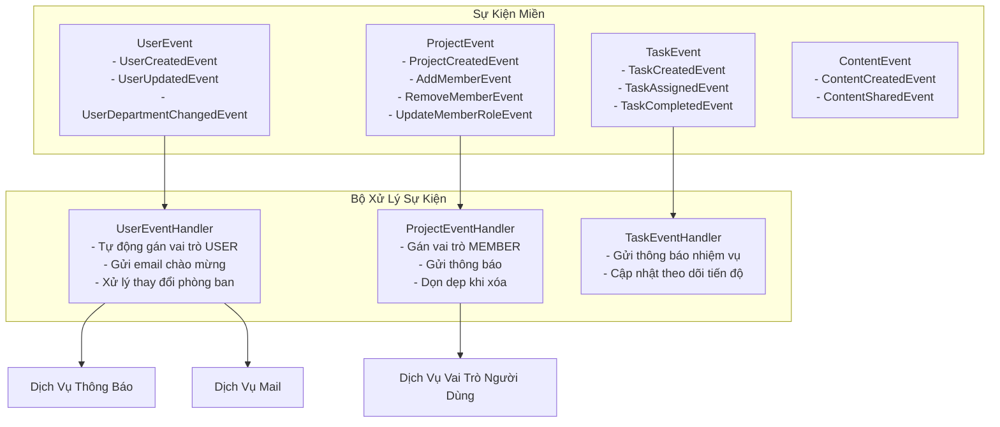

#### Xử Lý Sự Kiện:

**Sự Kiện Người Dùng:**
- `UserCreatedEvent`: Tự động gán vai trò USER, gửi thông báo và email chào mừng
- `UserDepartmentChangedEvent`: Cập nhật vai trò phòng ban, gửi thông báo

**Sự Kiện Dự Án:**
- `ProjectCreatedEvent`: Ghi nhận việc tạo dự án
- `AddMemberEvent`: Gán vai trò MEMBER cho người dùng trong phạm vi dự án
- `RemoveMemberEvent`: Xóa vai trò người dùng cho phạm vi dự án

**Sự Kiện Nhiệm Vụ:**
- `TaskCreatedEvent`: Gửi thông báo cho người được giao
- `TaskCompletedEvent`: Cập nhật số liệu tiến độ dự án

---

### 13. Chiến Lược Cache

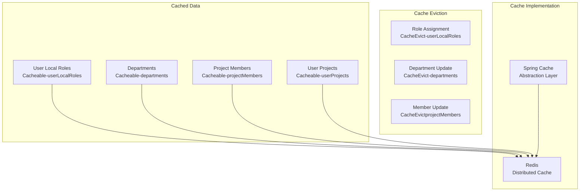

#### Triển Khai Cache:

**Các Thực Thể Được Cache:**
- Vai trò người dùng (cục bộ/không toàn cục): `@Cacheable("userLocalRoles")`
- Danh sách phòng ban: `@Cacheable("departments")`
- Thành viên dự án: `@Cacheable("projectMembers")`
- Dự án người dùng: `@Cacheable("userProjects")`

**Kích Hoạt Xóa Cache:**
- Gán/xóa vai trò: Xóa cache vai trò người dùng
- Cập nhật phòng ban: Xóa cache phòng ban
- Thay đổi thành viên dự án: Xóa cache thành viên và dự án người dùng

---

### 14. Các Mẫu Thiết Kế Chính

1. **Mẫu Repository**: JPA repositories cho trừu tượng hóa truy cập dữ liệu
2. **Mẫu Tầng Dịch Vụ**: Tách biệt logic nghiệp vụ khỏi controllers
3. **Mẫu DTO**: MapStruct cho ánh xạ entity-DTO và truyền dữ liệu
4. **Mẫu Hướng Sự Kiện**: Spring Events cho liên kết lỏng lẻo giữa các thành phần
5. **Mẫu Chiến Lược**: Nhiều phương thức xác thực (JWT, OAuth2)
8. **Mẫu Observer**: Event listeners cho các mối quan tâm xuyên suốt

---

### 15. Tính Năng Bảo Mật

#### Xác Thực:
- **Xác Thực JWT Token** với thời gian hết hạn có thể cấu hình
- **Tích Hợp Google OAuth2** cho đăng nhập xã hội
- **Mã Hóa Mật Khẩu** sử dụng băm BCrypt
- **Vô Hiệu Hóa Token** khi đăng xuất với danh sách đen

#### Phân Quyền:
- **Kiểm Soát Truy Cập Dựa Trên Vai Trò (RBAC)** với vai trò phân cấp
- **Quyền Hạn Dựa Trên Phạm Vi** (Toàn Cục, Phòng Ban, Dự Án)
- **Bảo Mật Cấp Phương Thức** với annotations @PreAuthorize
- **Kiểm Soát Truy Cập Cấp Tài Nguyên** dựa trên quyền sở hữu và thành viên

#### Cấu Hình Bảo Mật:
- **Cấu Hình CORS** cho yêu cầu cross-origin
- **Bảo Vệ CSRF** bị vô hiệu hóa cho API stateless
- **Headers Bảo Mật** cho bảo vệ XSS và clickjacking
- **Xác Thực Đầu Vào** với annotations Bean Validation

---

### 16. Tối Ưu Hóa Hiệu Suất

#### Tối Ưu Hóa Cơ Sở Dữ Liệu:
- **JPA Entity Graphs** cho tối ưu hóa truy vấn
- **Đánh Chỉ Mục Cơ Sở Dữ Liệu** trên các cột được truy vấn thường xuyên
- **Lazy Loading** cho mối quan hệ entity để giảm sử dụng bộ nhớ
- **Connection Pooling** với HikariCP cho kết nối cơ sở dữ liệu hiệu quả

#### Tối Ưu Hóa Ứng Dụng:
- **Redis Caching** cho dữ liệu được truy cập thường xuyên
- **Xử Lý Sự Kiện Bất Đồng Bộ** với @EnableAsync cho hoạt động không chặn
- **Hỗ Trợ Phân Trang** cho tập dữ liệu lớn
- **Tối Ưu Hóa Truy Vấn** với phương thức repository tùy chỉnh
   
---

### 17. Cấu Hình và Triển Khai

#### Thuộc Tính Ứng Dụng:
```yaml
# Server configuration
server:
  port: 3001
  compression:
    enabled: true
  tomcat:
    #    max-threads: 200
    max-connections: 10000

# Spring configuration
spring:
  # Application name
  application:
    name: FlowX

  servlet:
    multipart:
      max-file-size: 100MB
      max-request-size: 100MB
      enabled: true

  # Database configuration
  datasource:
    url: jdbc:postgresql://localhost:5432/flow_x
    username: root
    password: 4427
    driver-class-name: org.postgresql.Driver
    hikari:
      maximum-pool-size: 10
      minimum-idle: 5
      idle-timeout: 30000

  # JPA/Hibernate configuration
  jpa:
    hibernate:
      ddl-auto: update  # none, validate, update, create, create-drop
    show-sql: true
    properties:
      hibernate:
        format_sql: true
        dialect: org.hibernate.dialect.PostgreSQLDialect
    open-in-view: false

  # Security
  security:
    oauth2:
      client:
        registration:
          google:
            client-id: ${GOOGLE_CLIENT_ID:fghdufusdiufdsufdsufdsufdsufdsufdsufdsufdsufdsufds}
            client-secret: ${GOOGLE_CLIENT_SECRET:dewfef}
            scope:
              - openid
              - profile
              - email
            authorization-grant-type: authorization_code
            redirect-uri: "{baseUrl}/api/auth/oauth2/callback/{registrationId}"
        #
        #          github:
        #            client-id: ${GITHUB_CLIENT_ID}
        #            client-secret: ${GITHUB_CLIENT_SECRET}
        #            scope:
        #              - user:email
        #              - read:user
        #            authorization-grant-type: authorization_code
        #            redirect-uri: "{baseUrl}/api/auth/oauth2/callback/{registrationId}"

        provider:
          google:
            authorization-uri: https://accounts.google.com/o/oauth2/v2/auth
            token-uri: https://oauth2.googleapis.com/token
            user-info-uri: https://www.googleapis.com/oauth2/v3/userinfo
            user-name-attribute: sub

  #          github:
  #            authorization-uri: https://github.com/login/oauth/authorize
  #            token-uri: https://github.com/login/oauth/access_token
  #            user-info-uri: https://api.github.com/user
  #            user-name-attribute: id

  # JWT Configuration
  jwt:
    secret: 0142908dca9dcfecb19495caa765769f25bd51f9542219f684e074b221bd6b4c52ae5a0954e538efe2d5ea0f32f25ba1554e790d3c7ed4d4042d15917fd5db2d
    expiration: 86400000  # 24 hours in milliseconds
    refresh-expiration: 604800000  # 7 days in milliseconds

  data:
    # Redis configuration
    redis:
      host: localhost
      port: 6380
      #      username: root
      #      password: 4427
      database: 0
    #    cache:
    #      type: redis
    #      redis:
    #        time-to-live: 3600  # 1 hour in seconds
    #        key-prefix: flowx:
    #      type:
    #        caffeine:
    #            spec: maximumSize=1000,expireAfterAccess=1h

    # Redis cache configuration

  mail:
    host: smtp.gmail.com
    port: 587
    username: nguyengiapnf5@gmail.com
    password: qwkqelddzitreqnj
    properties:
      mail:
        smtp:
          auth: true
          starttls:
            enable: true

# Application specific configuration
app:
  oauth2:
    # Authorized redirect URIs
    redirectUri: ${OAUTH2_REDIRECT_URI:http://localhost:3000/oauth2/redirect}

minio:
  endpoint: http://localhost:9000
  access-key: minioadmin
  secret-key: minioadmin
  bucket-name: flowx-bucket
  region: us-east-1
  useSSL: false
  presigned:
    expiry: 3600
```


### 18. Cải Tiến Tương Lai

#### Tính Năng Dự Kiến:
1. **Hệ Thống Chat Thời Gian Thực** với triển khai WebSocket
2. **Tải Lên/Tải Xuống File** với tích hợp MinIO
3. **Báo Cáo Nâng Cao** với dashboard phân tích
4. **Hỗ Trợ Ứng Dụng Di Động** với tối ưu hóa REST API
5. **Công Cụ Workflow** cho quy trình nghiệp vụ tự động

#### Cải Tiến Kỹ Thuật:
1. **Di Chuyển Kiến Trúc Microservices**
2. **Event Sourcing** cho audit trails
3. **GraphQL API** cho truy xuất dữ liệu linh hoạt
4. **Triển Khai Kubernetes** cho điều phối container
5. **Giám Sát & Logging** với ELK stack

---

### 19. Kết Luận

FlowX là một hệ thống giao tiếp và quản lý doanh nghiệp được thiết kế với kiến trúc hiện đại, bảo mật cao và khả năng mở rộng tốt. Hệ thống áp dụng các thực hành tốt nhất trong phát triển ứng dụng Spring Boot và có thể đáp ứng nhu cầu quản lý dự án và giao tiếp trong doanh nghiệp vừa và lớn.

**Điểm Mạnh:**
- Kiến trúc rõ ràng với tách biệt mối quan tâm
- Bảo mật đa lớp với JWT và OAuth2
- Kiến trúc hướng sự kiện cho liên kết lỏng lẻo
- Chiến lược cache hiệu quả với Redis
- Tài liệu API đầy đủ với OpenAPI

**Khuyến Nghị:**
- Triển khai tính năng thời gian thực với WebSocket
- Thêm kiểm thử toàn diện với unit và integration tests
- Thiết lập CI/CD pipeline cho triển khai tự động
- Giám sát và logging cho môi trường production
- Kiểm thử hiệu suất và tối ưu hóa

---

*Phiên Bản Tài Liệu: 1.0*  
*Cập Nhật Lần Cuối: Tháng 5 năm 2025*  
*Tác Giả: FlowX by NguyenGiap*