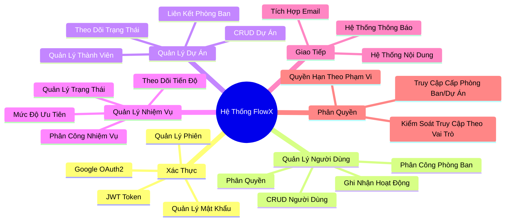
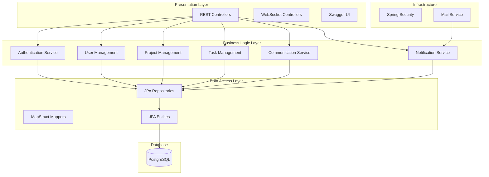
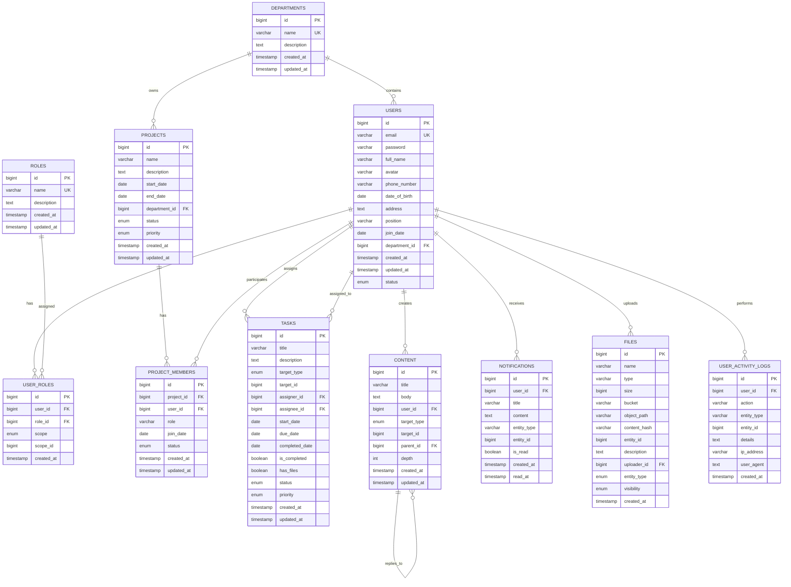
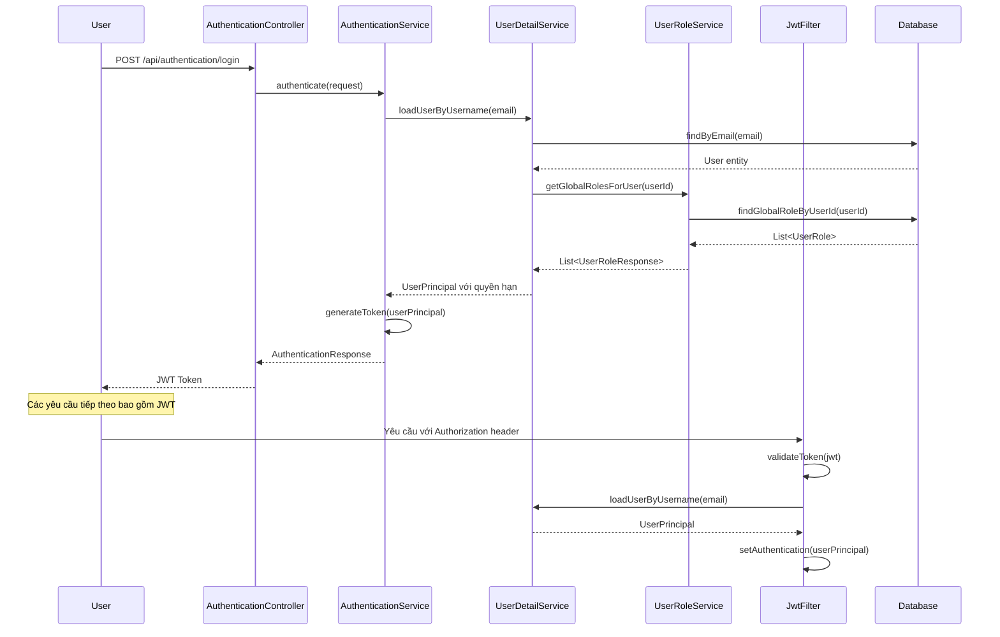
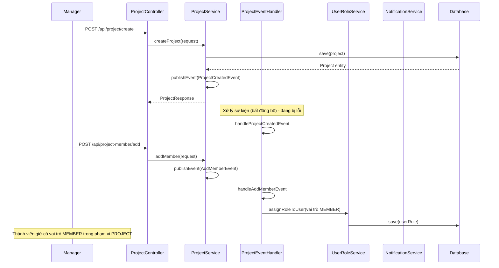
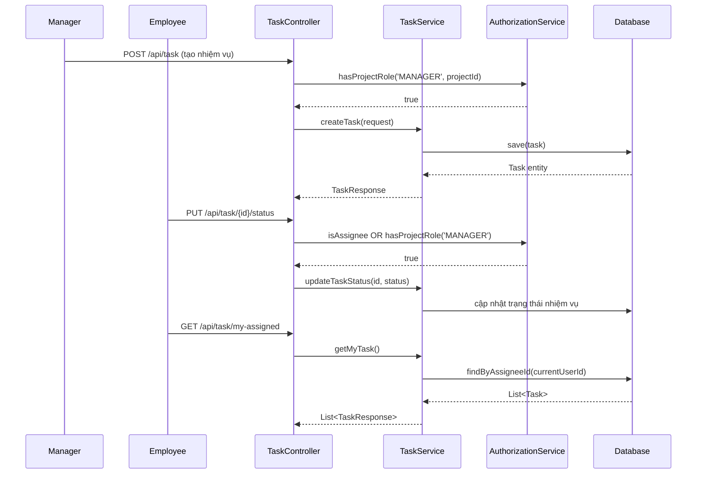
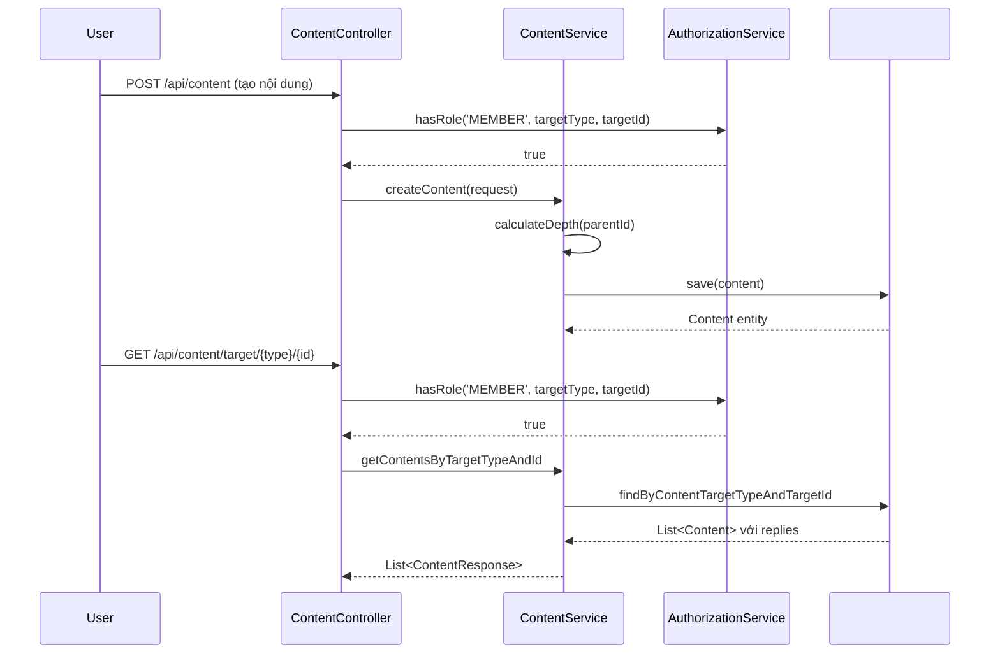
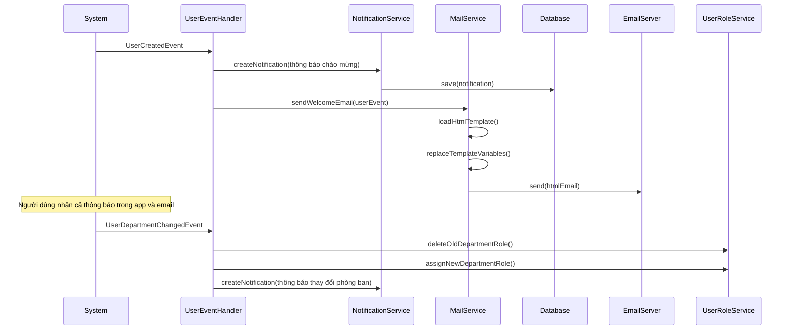
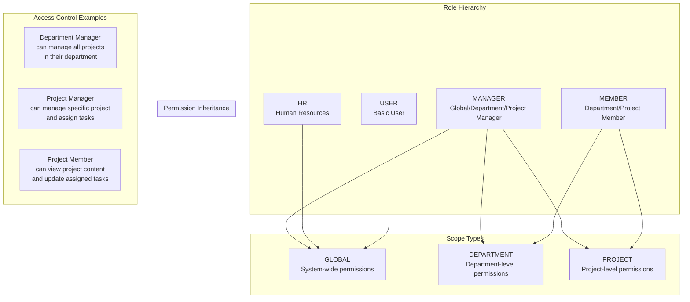
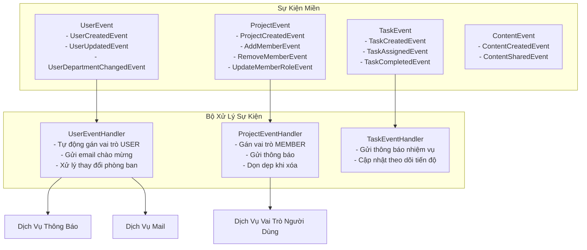

# Báo Cáo Kỹ Thuật FlowX
## Hệ Thống Giao Tiếp và Quản Lý Doanh Nghiệp

### Mục Lục
1. [Tổng Quan Hệ Thống](#1-tổng-quan-hệ-thống)
2. [Tính Năng Cốt Lõi](#2-tính-năng-cốt-lõi-đã-triển-khai)
3. [Kiến Trúc Hệ Thống](#3-kiến-trúc-hệ-thống)
4. [Sơ Đồ Cơ Sở Dữ Liệu](#4-sơ-đồ-cơ-sở-dữ-liệu)
5. [Luồng Xác Thực và Phân Quyền](#5-luồng-xác-thực-và-phân-quyền)
6. [Luồng Quản Lý Dự Án](#6-luồng-quản-lý-dự-án)
7. [Luồng Quản Lý Nhiệm Vụ](#7-luồng-quản-lý-nhiệm-vụ)
8. [Luồng Nội Dung và Giao Tiếp](#8-luồng-nội-dung-và-giao-tiếp)
9. [Luồng Hệ Thống Thông Báo](#9-luồng-hệ-thống-thông-báo)
10. [Mô Hình Bảo Mật và Phân Quyền](#10-mô-hình-bảo-mật-và-phân-quyền)
11. [Tóm Tắt API Endpoints](#11-tóm-tắt-api-endpoints)
12. [Kiến Trúc Hướng Sự Kiện](#12-kiến-trúc-hướng-sự-kiện)
13. [Các Mẫu Thiết Kế Chính](#13-các-mẫu-thiết-kế-chính)
14. [Tính Năng Bảo Mật](#14-tính-năng-bảo-mật)
15. [Tối Ưu Hóa Hiệu Suất](#15-tối-ưu-hóa-hiệu-suất)
16. [Cấu Hình và Triển Khai](#16-cấu-hình-và-triển-khai)
17. [Cải Tiến Tương Lai](#17-cải-tiến-tương-lai)

---

### 1. Tổng Quan Hệ Thống

FlowX là một hệ thống quản lý và giao tiếp doanh nghiệp được xây dựng trên nền tảng Spring Boot, tập trung vào việc quản lý dự án, phân quyền người dùng, và giao tiếp nội bộ tổ chức.

#### Công Nghệ Sử Dụng:
- **Backend**: Spring Boot 3.x, Spring Security, Spring Data JPA
- **Cơ Sở Dữ Liệu**: PostgreSQL (chính), Redis (cache)
- **Xác Thực**: JWT, Google OAuth2
- **Lưu Trữ File**: MinIO/S3
- **Email**: Spring Mail
- **Tài Liệu**: OpenAPI/Swagger
- **Công Cụ Build**: Maven

---

### 2. Tính Năng Cốt Lõi (Đã Triển Khai)



---

### 3. Kiến Trúc Hệ Thống



---

### 4. Sơ Đồ Cơ Sở Dữ Liệu




---

### 5. Luồng Xác Thực và Phân Quyền



---

### 6. Luồng Quản Lý Dự Án



---

### 7. Luồng Quản Lý Nhiệm Vụ



---

### 8. Luồng Nội Dung và Giao Tiếp



---

### 9. Luồng Hệ Thống Thông Báo



---

### 10. Mô Hình Bảo Mật và Phân Quyền



---

### 11. API Endpoints Summary


#### **API Xác Thực (`/api/authentication`)**
- `POST /api/authentication/login` - Đăng nhập bằng email/mật khẩu
- `POST /api/authentication/google-oath2` - Đăng nhập Google OAuth2
- `PUT /api/authentication/change-password` - Thay đổi mật khẩu người dùng
- `POST /api/authentication/logout` - Đăng xuất người dùng

#### **API Quản Lý Người Dùng (`/api/user`)**
- `POST /api/user/create` - Tạo người dùng mới (MANAGER/HR only)
- `PUT /api/user/update/{id}` - Cập nhật thông tin người dùng
- `PUT /api/user/change-department/{id}` - Thay đổi phòng ban người dùng
- `PUT /api/user/update-status/{id}` - Cập nhật trạng thái người dùng
- `DELETE /api/user/delete/{id}` - Xóa người dùng
- `GET /api/user/getall` - Lấy tất cả người dùng
- `GET /api/user/get-by-department/{departmentId}` - Lấy người dùng theo phòng ban
- `GET /api/user/get/{id}` - Lấy thông tin người dùng theo ID

#### **API Quản Lý Phòng Ban (`/api/department`)**
- `GET /api/department/getall` - Lấy tất cả phòng ban
- `GET /api/department/get/{id}` - Lấy thông tin phòng ban theo ID
- `POST /api/department/create` - Tạo phòng ban mới
- `PUT /api/department/update/{id}` - Cập nhật thông tin phòng ban
- `DELETE /api/department/delete/{id}` - Xóa phòng ban

#### **API Quản Lý Dự Án (`/api/project`)**
- `POST /api/project/create` - Tạo dự án mới
- `PUT /api/project/update/{id}` - Cập nhật thông tin dự án
- `PUT /api/project/{id}/status` - Cập nhật trạng thái dự án
- `PUT /api/project/{id}/complete` - Đánh dấu dự án hoàn thành
- `DELETE /api/project/delete/{id}` - Xóa dự án
- `GET /api/project/getall` - Lấy tất cả dự án
- `GET /api/project/get/{id}` - Lấy thông tin dự án theo ID
- `GET /api/project/get/status` - Lấy dự án theo trạng thái
- `GET /api/project/get/department/{departmentId}` - Lấy dự án theo phòng ban

#### **API Quản Lý Thành Viên Dự Án (`/api/project-member`)**
- `POST /api/project-member/add` - Thêm thành viên vào dự án
- `PUT /api/project-member/update/{id}` - Cập nhật thông tin thành viên dự án
- `PUT /api/project-member/bulk-status` - Cập nhật trạng thái nhiều thành viên
- `DELETE /api/project-member/delete/{id}` - Xóa thành viên khỏi dự án
- `GET /api/project-member/get/{id}` - Lấy thông tin thành viên dự án
- `GET /api/project-member/project/{projectId}` - Lấy tất cả thành viên của dự án
- `GET /api/project-member/user/{userId}` - Lấy tất cả dự án của người dùng
- `PUT /api/project-member/{id}/status` - Cập nhật trạng thái thành viên
- `GET /api/project-member/project/{projectId}/active` - Lấy thành viên đang hoạt động

#### **API Quản Lý Nhiệm Vụ (`/api/task`)**
- `POST /api/task` - Tạo nhiệm vụ mới
- `PUT /api/task/{id}` - Cập nhật thông tin nhiệm vụ
- `DELETE /api/task/{id}` - Xóa nhiệm vụ
- `GET /api/task` - Lấy tất cả nhiệm vụ (MANAGER only)
- `PUT /api/task/{id}/status` - Cập nhật trạng thái nhiệm vụ
- `GET /api/task/project/{projectId}` - Lấy nhiệm vụ theo dự án
- `GET /api/task/department/{departmentId}` - Lấy nhiệm vụ theo phòng ban
- `GET /api/task/status/{status}` - Lấy nhiệm vụ theo trạng thái
- `GET /api/task/my-created` - Lấy nhiệm vụ do người dùng hiện tại tạo
- `GET /api/task/my-assigned` - Lấy nhiệm vụ được giao cho người dùng hiện tại
- `GET /api/task/my-assigned/project/{projectId}` - Lấy nhiệm vụ của tôi theo dự án
- `GET /api/task/my-assigned/status/{status}` - Lấy nhiệm vụ của tôi theo trạng thái
- `PUT /api/task/{id}/complete` - Đánh dấu nhiệm vụ hoàn thành
- `PUT /api/task/{id}/incomplete` - Đánh dấu nhiệm vụ chưa hoàn thành

#### **API Quản Lý Nội Dung (`/api/content`)**
- `POST /api/content` - Tạo nội dung/bài viết mới
- `PUT /api/content/{id}` - Cập nhật nội dung
- `DELETE /api/content/{id}` - Xóa nội dung
- `GET /api/content/getall` - Lấy tất cả nội dung (MANAGER only)
- `GET /api/content/get/{id}` - Lấy nội dung theo ID
- `GET /api/content/target/{type}/{id}` - Lấy nội dung theo mục tiêu (PROJECT/DEPARTMENT/GLOBAL)
- `GET /api/content/parent/{parentId}` - Lấy nội dung con (replies)

#### **API Quản Lý Thông Báo (`/api/notification`)**
- `POST /api/notification` - Tạo thông báo mới
- `GET /api/notification/my-notifications` - Lấy thông báo của người dùng hiện tại
- `PUT /api/notification/{id}/mark-read` - Đánh dấu thông báo đã đọc
- `PUT /api/notification/{id}/mark-unread` - Đánh dấu thông báo chưa đọc
- `PUT /api/notification/mark-all-read` - Đánh dấu tất cả thông báo đã đọc

#### **API Quản Lý Vai Trò (`/api/role`)**
- `GET /api/role` - Lấy tất cả vai trò trong hệ thống

#### **API Quản Lý Vai Trò Người Dùng (`/api/user-role`)**
- `GET /api/user-role/user/{userId}` - Lấy tất cả vai trò của người dùng
- `GET /api/user-role/role/{roleId}` - Lấy tất cả người dùng có vai trò cụ thể
- `GET /api/user-role/global/{userId}` - Lấy vai trò toàn cục của người dùng
- `GET /api/user-role/local/{userId}` - Lấy vai trò cục bộ của người dùng
- `POST /api/user-role/assign` - Gán vai trò cho người dùng
- `DELETE /api/user-role/delete/{id}` - Xóa vai trò khỏi người dùng

#### **API Quản Lý Nhật Ký Hoạt Động (`/api/activity-log`)**
- `GET /api/activity-log/get-all` - Lấy tất cả nhật ký hoạt động (MANAGER/HR only)
- `GET /api/activity-log/{userId}` - Lấy nhật ký hoạt động của người dùng cụ thể
- `GET /api/activity-log/me` - Lấy nhật ký hoạt động của người dùng hiện tại

#### **API Quản Lý File (`/api/file`)**
- `POST /api/file/upload` - Tải lên file mới
- `GET /api/file/{id}` - Lấy thông tin file theo ID
- `GET /api/file/download/{id}` - Tải xuống file
- `PUT /api/file/{id}` - Cập nhật thông tin file
- `DELETE /api/file/{id}` - Xóa file
- `GET /api/file/entity/{entityType}/{entityId}` - Lấy file theo entity

#### **Phân Quyền Truy Cập API:**

**Toàn Cục (GLOBAL):**
- `MANAGER`: Truy cập tất cả API
- `HR`: Truy cập API quản lý người dùng và vai trò
- `USER`: Truy cập API cơ bản (xem thông tin, cập nhật profile)

**Cấp Phòng Ban (DEPARTMENT):**
- `MANAGER`: Quản lý tất cả dự án và người dùng trong phòng ban
- `MEMBER`: Xem thông tin phòng ban và tham gia hoạt động

**Cấp Dự Án (PROJECT):**
- `MANAGER`: Quản lý dự án, thành viên, và nhiệm vụ
- `MEMBER`: Xem thông tin dự án, cập nhật nhiệm vụ được giao

#### **Bảo Mật:**
- Gần như tất cả API đều yêu cầu JWT token trong header `Authorization: Bearer <token>`
- Phân quyền được kiểm tra ở cấp method với `@PreAuthorize`
- CORS được cấu hình cho phép cross-origin requests
- Rate limiting và input validation được áp dụng cho tất cả endpoints
- Sensitive operations được log trong `user_activity_logs`

#### **Authorize Service:**

```java
@Component("authorize")
@Slf4j
@RequiredArgsConstructor
@FieldDefaults(level = AccessLevel.PRIVATE, makeFinal = true)
public class AuthorizationService {
    UserRoleService userRoleService;
    EntityLookupService entityLookupService;

    public List<UserRoleResponse> getUserAllRoles(Long userId) {
        return userRoleService.getNonGlobalRolesForUser(userId);
    }

    public boolean hasRole(String roleName, RoleScope roleScope, Long scopeId) {
        Long userId = getUserId();
        List<UserRoleResponse> userRoles = getUserAllRoles(userId);

        return userRoles.stream()
                .anyMatch(r -> r.getRole().getName().equals(roleName)
                        && r.getScope() == roleScope
                        && r.getScopeId().equals(scopeId));
    }

    public boolean hasProjectRole(String roleName, Long projectId) {
        if (roleName == null || projectId == null) return false;
        if (roleName.equalsIgnoreCase("MEMBER")) return hasRole(roleName, RoleScope.PROJECT, projectId);

        Project project = entityLookupService.getProjectById(projectId);
        return hasDepartmentRole(roleName, project.getDepartment().getId()) || hasRole(roleName, RoleScope.PROJECT, projectId);
    }

    public boolean hasDepartmentRole(String roleName, Long departmentId) {
        if (roleName == null || departmentId == null) return false;
        return hasRole(roleName, RoleScope.DEPARTMENT, departmentId);
    }

    public Long getUserId() {
        var context = SecurityContextHolder.getContext();
        if (context.getAuthentication() == null || context.getAuthentication().getPrincipal() == null)
            throw new FlowXException(FlowXError.UNAUTHORIZED, "No authenticated user found");

        UserPrincipal userPrincipal = (UserPrincipal) context.getAuthentication().getPrincipal();
        return userPrincipal.getId();
    }
}
```

---

### 12. Kiến Trúc Hướng Sự Kiện



#### Xử Lý Sự Kiện:

**Sự Kiện Người Dùng:**
- `UserCreatedEvent`: Tự động gán vai trò USER, gửi thông báo và email chào mừng
- `UserDepartmentChangedEvent`: Cập nhật vai trò phòng ban, gửi thông báo

**Sự Kiện Dự Án:**
- `ProjectCreatedEvent`: Ghi nhận việc tạo dự án
- `AddMemberEvent`: Gán vai trò MEMBER cho người dùng trong phạm vi dự án
- `RemoveMemberEvent`: Xóa vai trò người dùng cho phạm vi dự án

**Sự Kiện Nhiệm Vụ:**
- `TaskCreatedEvent`: Gửi thông báo cho người được giao
- `TaskCompletedEvent`: Cập nhật số liệu tiến độ dự án

---

### 13. Các Mẫu Thiết Kế Chính

1. **Repository Pattern**: JPA repositories cho trừu tượng hóa truy cập dữ liệu
2. **Service, Component Pattern**: Tách biệt logic nghiệp vụ khỏi controllers
3. **DTO, Mapper**: MapStruct cho ánh xạ entity-DTO và truyền dữ liệu
4. **Event driven**: Spring Events cho liên kết lỏng lẻo giữa các thành phần

---

### 14. Tính Năng Bảo Mật

#### Xác Thực:
- **Xác Thực JWT Token** với thời gian hết hạn có thể cấu hình
- **Tích Hợp Google OAuth2** cho đăng nhập xã hội
- **Mã Hóa Mật Khẩu** sử dụng băm BCrypt
- **Vô Hiệu Hóa Token** khi đăng xuất với danh sách đen

#### Phân Quyền:
- **Kiểm Soát Truy Cập Dựa Trên Vai Trò (RBAC)** với vai trò phân cấp
- **Quyền Hạn Dựa Trên Phạm Vi** (Toàn Cục, Phòng Ban, Dự Án)
- **Bảo Mật Cấp Phương Thức** với annotations @PreAuthorize
- **Kiểm Soát Truy Cập Cấp Tài Nguyên** dựa trên quyền sở hữu và thành viên

#### Cấu Hình Bảo Mật:
- **Cấu Hình CORS** cho yêu cầu cross-origin
- **Bảo Vệ CSRF** bị vô hiệu hóa cho API stateless
- **Headers Bảo Mật** cho bảo vệ XSS và clickjacking
- **Xác Thực Đầu Vào** với annotations Bean Validation

---

### 15. Tối Ưu Hóa Hiệu Suất

#### Tối Ưu Hóa Cơ Sở Dữ Liệu:
- **JPA Entity Graphs** cho tối ưu hóa truy vấn
- **Đánh Chỉ Mục Cơ Sở Dữ Liệu** trên các cột được truy vấn thường xuyên
- **Lazy Loading** cho mối quan hệ entity để giảm sử dụng bộ nhớ
- **Connection Pooling** với HikariCP cho kết nối cơ sở dữ liệu hiệu quả

#### Tối Ưu Hóa Ứng Dụng:
- **Xử Lý Sự Kiện Bất Đồng Bộ** với @EnableAsync cho hoạt động không chặn - đang bị lỗi bất đồng bộ
- **Tối Ưu Hóa Truy Vấn** với phương thức repository tùy chỉnh
   
---

### 16. Cấu Hình và Triển Khai

#### Thuộc Tính Ứng Dụng:
```yaml
# Server configuration
server:
  port: 3001
  compression:
    enabled: true
  tomcat:
    #    max-threads: 200
    max-connections: 10000

# Spring configuration
spring:
  # Application name
  application:
    name: FlowX

  servlet:
    multipart:
      max-file-size: 100MB
      max-request-size: 100MB
      enabled: true

  # Database configuration
  datasource:
    url: jdbc:postgresql://localhost:5432/flow_x
    username: 
    password: 
    driver-class-name: org.postgresql.Driver
    hikari:
      maximum-pool-size: 10
      minimum-idle: 5
      idle-timeout: 30000

  # JPA/Hibernate configuration
  jpa:
    hibernate:
      ddl-auto: update  # none, validate, update, create, create-drop
    show-sql: true
    properties:
      hibernate:
        format_sql: true
        dialect: org.hibernate.dialect.PostgreSQLDialect
    open-in-view: false

  # Security
  security:
    oauth2:
      client:
        registration:
          google:
            client-id: ${GOOGLE_CLIENT_ID:fghdufusdiufdsufdsufdsufdsufdsufdsufdsufdsufdsufds}
            client-secret: ${GOOGLE_CLIENT_SECRET:dewfef}
            scope:
              - openid
              - profile
              - email
            authorization-grant-type: authorization_code
            redirect-uri: "{baseUrl}/api/auth/oauth2/callback/{registrationId}"
        #
        #          github:
        #            client-id: ${GITHUB_CLIENT_ID}
        #            client-secret: ${GITHUB_CLIENT_SECRET}
        #            scope:
        #              - user:email
        #              - read:user
        #            authorization-grant-type: authorization_code
        #            redirect-uri: "{baseUrl}/api/auth/oauth2/callback/{registrationId}"

        provider:
          google:
            authorization-uri: https://accounts.google.com/o/oauth2/v2/auth
            token-uri: https://oauth2.googleapis.com/token
            user-info-uri: https://www.googleapis.com/oauth2/v3/userinfo
            user-name-attribute: sub

  #          github:
  #            authorization-uri: https://github.com/login/oauth/authorize
  #            token-uri: https://github.com/login/oauth/access_token
  #            user-info-uri: https://api.github.com/user
  #            user-name-attribute: id

  # JWT Configuration
  jwt:
    secret: 0142908dca9dcfecb19495caa765769f25bd51f9542219f684e074b221bd6b4c52ae5a0954e538efe2d5ea0f32f25ba1554e790d3c7ed4d4042d15917fd5db2d
    expiration: 86400000  # 24 hours in milliseconds
    refresh-expiration: 604800000  # 7 days in milliseconds

  data:
    # Redis configuration
    redis:
      host: localhost
      port: 6380
      #      username: root
      #      password: 4427
      database: 0
    #    cache:
    #      type: redis
    #      redis:
    #        time-to-live: 3600  # 1 hour in seconds
    #        key-prefix: flowx:
    #      type:
    #        caffeine:
    #            spec: maximumSize=1000,expireAfterAccess=1h

    # Redis cache configuration

  mail:
    host: smtp.gmail.com
    port: 587
    username: nguyengiapnf5@gmail.com
    password: 
    properties:
      mail:
        smtp:
          auth: true
          starttls:
            enable: true

# Application specific configuration
app:
  oauth2:
    # Authorized redirect URIs
    redirectUri: ${OAUTH2_REDIRECT_URI:http://localhost:3000/oauth2/redirect}

minio:
  endpoint: http://localhost:9000
  access-key: 
  secret-key: 
  bucket-name: flowx-bucket
  region: us-east-1
  useSSL: false
  presigned:
    expiry: 3600
```


### 17. Cải Tiến Tương Lai

#### Tính Năng Chưa tiển khai:
1. **Hệ Thống Chat Thời Gian Thực** với triển khai WebSocket 
   - Em chưa nghĩ ra một cấu trúc conversation - member - message để đồng bộ với department, project
2. **Tải Lên/Tải Xuống File** với tích hợp MinIO
   - Chưa triển khai
3. **Báo Cáo Nâng Cao** với dashboard phân tích 
   - Triển khai ở front end
4. **Triển khai caching với Redis và JVM Caffeine** 
   - Chưa tối ưu được
   - Dự kiến Cache Permission của User ở Caffeine để tối ưu API, các thông tin khác cần cache sẽ cache phân tán ở Redis, không bao gồm các dữ liệu nhiều thay đổi - các dữ liệu dùng websocket

---


*Phiên Bản Tài Liệu: 1.0*  
*Cập Nhật Lần Cuối: Tháng 5 năm 2025*  
*Tác Giả: FlowX by NguyenGiap*